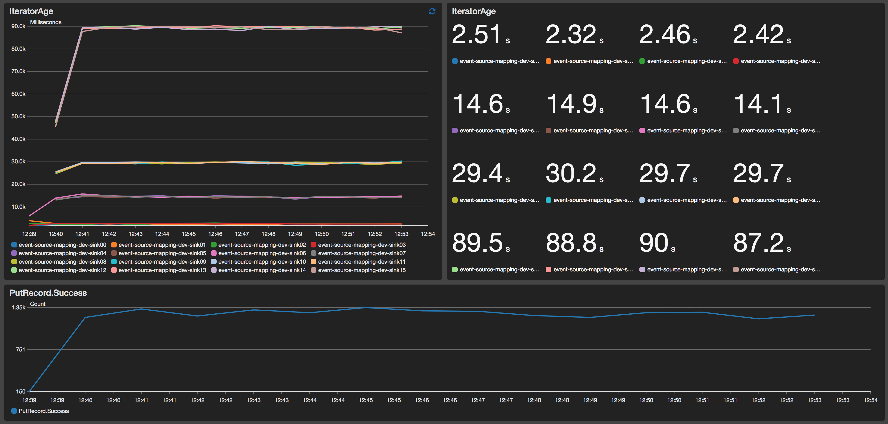

### Event Source Mapping Custom resource

Meant to be a 1:1 replacement for [AWS::Lambda::EventSourceMapping](https://docs.aws.amazon.com/AWSCloudFormation/latest/UserGuide/aws-resource-lambda-eventsourcemapping.html).
This custom resource will not bail out at the first exception whn attempting to register a Lambda to a Kinesis Stream.
This example deploys 16 Lambda consumers for one Kinesis stream.

Just deploy this stack with `sls deploy`, then run `sls invoke local -f loader` to load some data in your stream, and then modify the `BatchSize` parameter in each `EventSourceMapping` object in `serverless.yaml`:

```yaml
   EventSourceMapping00:
      Type: Custom::EventSourceMapping
      Properties:
        ServiceToken: 
          Fn::GetAtt: [MapperLambdaFunction, Arn]
        EventSourceArn:
          Fn::GetAtt: [EventStream,Arn]
        FunctionName: 
          Fn::GetAtt: [Sink00LambdaFunction,Arn]
        StartingPosition: LATEST
        BatchSize: 5
        Enabled: True
```
The Custom resource will retry registering any time it gets a `ProvisionedThroughputExceededException` or a `LimitExceededException`, without bailing out.
The `serverless.yaml` file also sets a `PAUSE` environment variable, to use the _sleeping pattern_ in the sink function.
By requiring the sink function to sleep for the specified time, we can effectively control the rate of invocation for our subscriptions and effectively be able to bypass the 5 read/second maximum rate limits.

Above is an example of the runtime behavior for this pattern, where each group of 4 functions is given a different sleep time. 


